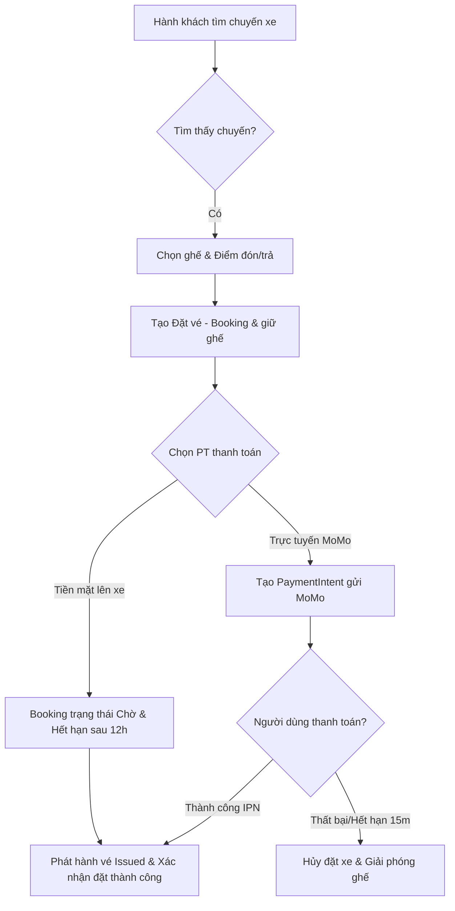

# TỔNG HỢP NGHIỆP VỤ BACKEND - HỆ THỐNG ĐẶT VÉ XE KHÁCH (PBL3)

Tài liệu này tổng hợp toàn bộ các quy trình nghiệp vụ (Business Logic) cốt lõi đang được xử lý ở tầng Backend của ứng dụng **PBL3 - Hệ thống Đặt vé xe khách trực tuyến**. Hệ thống được xây dựng trên nền tảng **ASP.NET Core** kết hợp với **Entity Framework Core** và cơ sở dữ liệu **PostgreSQL**.

---

## 1. Tổng quan các Phân hệ chính

Hệ thống đóng vai trò cầu nối trung gian giữa 3 nhóm đối tượng chính:
1. **Hành khách (Passengers/Users)**: Người dùng cuối có nhu cầu tìm kiếm chuyến xe, chọn ghế, đặt vé, thực hiện thanh toán trực tuyến hoặc tiền mặt, gửi phản hồi/đánh giá.
2. **Đối tác Nhà xe (Bus Companies/Bus Admin)**: Đơn vị cung cấp dịch vụ vận tải, quản lý thông tin xe, cấu hình sơ đồ ghế, thiết lập tuyến đường, quản lý chuyến xe chạy hằng ngày.
3. **Quản trị hệ thống (System Admin)**: Đơn vị kiểm duyệt vận hành toàn hệ thống, phê duyệt nhà xe mới, xử lý các yêu cầu hoàn tiền, kiểm duyệt đánh giá và phân tích doanh thu.

---

## 2. Chi tiết các Luồng nghiệp vụ cốt lõi

---

### 2.1. Phân hệ Đặt vé & Giữ ghế (Booking & Seat Reservation)
*Đây là nghiệp vụ cốt lõi và phức tạp nhất, đòi hỏi tính nhất quán dữ liệu cao để tránh đặt trùng ghế.*

* **Quy trình thực hiện (`BookingService.CreateBookingAsync`)**:
  1. **Kiểm tra thông tin chuyến xe**: Chuyến xe phải có trạng thái `Scheduled`, tuyến đường phải hoạt động (`IsActive`) và thuộc nhà xe đã được hệ thống phê duyệt (`IsApproved`).
  2. **Xác thực Điểm đón / Điểm trả**: 
     - Điểm đón (`PickupStop`) và Điểm trả (`DropoffStop`) do khách chọn phải thuộc tuyến đường đi của chuyến xe.
     - Thứ tự dừng (`StopOrder`) của Điểm đón phải đứng trước Điểm trả trên cùng một lộ trình.
  3. **Kiểm tra & Giữ ghế (Seat Availability Check)**:
     - Hệ thống quét danh sách các ghế **KHÔNG khả dụng** (đã bán hoặc đang giữ):
       - Vé đã được phát hành (`Status` là `Issued` hoặc `CheckedIn`) thuộc chuyến xe đó.
       - Ghế đang được giữ trong bảng `SeatHold` (`Status = Held` và chưa hết hạn `ExpiresAt > Now`).
     - Nếu ghế khách chọn nằm trong danh sách không khả dụng, hệ thống lập tức từ chối và thông báo lỗi.
  4. **Thiết lập thời gian hết hạn**:
     - Thanh toán tiền mặt tại xe (chỉ được phép khi nhà xe bật thuộc tính `AllowPayOnBoard`): Hết hạn sau 12 giờ.
     - Thanh toán online: Hết hạn sau 15 phút. Nếu quá thời gian này hành khách không thanh toán, ghế giữ sẽ bị giải phóng để đảm bảo quyền lợi cho người khác.
  5. **Tạo mã vé ngẫu nhiên**: Vé được tạo ở trạng thái `PendingPayment` với mã định dạng: `TKT-[YYYYMMDD]-[8 ký tự ngẫu nhiên]`.

---

### 2.2. Phân hệ Thanh toán & Tích hợp Ví điện tử MoMo
*Hỗ trợ tích hợp cổng thanh toán MoMo theo phương thức Server-to-Server đảm bảo an toàn giao dịch.*

* **Tạo giao dịch trực tuyến (`PaymentService.CreateMomoPaymentAsync`)**:
  - Tạo mã chữ ký bảo mật SHA-256 HMAC từ các trường thông tin giao dịch (`partnerCode`, `accessKey`, `amount`, `orderId`, `requestId`...) kết hợp với `SecretKey`.
  - Gửi yêu cầu sang API MoMo để lấy liên kết thanh toán (`PayUrl`), mã QR (`QrCodeUrl`) và liên kết sâu ứng dụng di động (`Deeplink`).
  - Ghi nhận trạng thái thanh toán ban đầu của `PaymentIntent` là `Created`.

* **Xử lý kết quả thanh toán tự động (IPN - Instant Payment Notification)**:
  - Nhận tín hiệu Server-to-Server từ MoMo.
  - Xác thực chữ ký bảo mật gửi kèm để chống gian lận thay đổi số tiền hoặc mã đơn hàng.
  - **Thanh toán thành công**:
    - Cập nhật trạng thái `PaymentIntent` thành `Succeeded`.
    - Chuyển trạng thái Booking thành `Paid` (Đã thanh toán) và xóa thời hạn hết hạn.
    - Cập nhật trạng thái vé liên quan thành `Issued` (Đã phát hành).
  - **Thanh toán thất bại / Hủy bỏ**:
    - Chuyển trạng thái `PaymentIntent` thành `Failed`.
    - Chuyển Booking và các vé sang trạng thái `Cancelled` để ngay lập tức giải phóng ghế ngồi cho chuyến xe đó.

---

### 2.3. Phân hệ Hoàn tiền & Hủy vé (Refunds & Cancellation)
*Quản lý nghiêm ngặt việc hoàn trả tiền để tránh tổn thất cho cả nhà xe lẫn hành khách.*

* **Hủy vé chưa thanh toán**: Khách hàng được phép hủy các Booking chưa thanh toán trực tiếp qua hệ thống. Ghế giữ sẽ được giải phóng ngay lập tức.
* **Yêu cầu hoàn tiền (`RefundManagementService.CreateRefundRequestAsync`)**:
  - Đối với vé đã thanh toán thành công (`Paid`), hành khách không thể tự hủy trực tiếp mà phải gửi yêu cầu hoàn tiền kèm theo lý do cụ thể.
  - Hệ thống kiểm tra số tiền yêu cầu hoàn không được vượt quá số tiền thực tế khách đã thanh toán trong `PaymentIntent`.
  - Trạng thái yêu cầu ban đầu sẽ ở mức `Pending`.
* **Phê duyệt hoàn tiền từ Admin (`ApproveRefundAsync` / `RejectRefundAsync`)**:
  - **Admin Từ chối**: Yêu cầu chuyển sang trạng thái `Rejected` kèm ghi chú giải thích từ Admin.
  - **Admin Đồng ý**:
    - Tạo bản ghi hoàn tiền `Refund` ở trạng thái `Processing`.
    - Gửi yêu cầu hoàn tiền tự động sang cổng MoMo thông qua API hoàn tiền của đối tác (`/v2/gateway/api/refund`).
    - Nếu MoMo hoàn tiền thành công, trạng thái `Refund` chuyển sang `Completed` và Booking chuyển sang `Refunded`.
    - Nếu API MoMo lỗi, hệ thống vẫn ghi nhận phê duyệt thành công từ phía Admin nhưng đánh dấu cảnh báo lỗi kỹ thuật để Admin có thể kiểm tra và hoàn tiền thủ công cho hành khách sau.

---

### 2.4. Phân hệ Quản lý Tìm kiếm & Định vị (Trip & Location Search)
*Hỗ trợ hành khách tìm kiếm chính xác lộ trình di chuyển mong muốn một cách trực quan.*

* **Tìm kiếm địa điểm hành chính**:
  - Cung cấp danh sách Tỉnh/Thành phố (`Province`), Quận/Huyện (`District`), Phường/Xã (`Ward`) chuẩn hóa từ cơ sở dữ liệu quốc gia giúp hành khách tìm trạm đón trả chi tiết.
  - Cho phép tra cứu danh sách Bến xe / Trạm dừng (`Station`) thuộc từng địa bàn.
* **Tìm kiếm Chuyến xe theo lộ trình (`TripSearchService.SearchTripsAsync`)**:
  - Lọc chính xác các chuyến xe chạy đúng ngày khởi hành, đi qua Tỉnh đi và Tỉnh đến đã chọn.
  - Lọc nâng cao theo Quận/Huyện, Phường/Xã của cả điểm đi và điểm đến.
  - Tự động thống kê số ghế còn trống theo thời gian thực (Ghế trống = Tổng ghế - Vé đã bán - Ghế đang giữ).
  - Tính toán giá vé cơ bản thấp nhất, điểm đánh giá trung bình từ đánh giá khách hàng để hiển thị trực quan lên giao diện tìm kiếm.

---

### 2.5. Phân hệ Quản lý Nhà xe & Cơ cấu Đội xe (Fleet & Profile Management)
*Cung cấp công cụ tối ưu cho Nhà xe vận hành đội xe và khai thác tuyến đường.*

* **Đăng ký Trở thành Đối tác Nhà xe**:
  - Người dùng gửi yêu cầu nâng cấp tài khoản lên đối tác nhà xe (`BusAdminUpgradeRequest`). Admin hệ thống xem xét giấy phép kinh doanh, thông tin vận tải để duyệt nâng cấp.
* **Quản lý Hồ sơ Nhà xe**:
  - Nhà xe cập nhật các thông tin hiển thị (Số điện thoại, Địa chỉ văn phòng, Quy định hành lý, Quy định hủy vé...).
  - Các thay đổi thông tin pháp lý quan trọng được lưu dưới dạng yêu cầu cập nhật (`CompanyProfileUpdateRequest`) cần có sự kiểm duyệt của Admin hệ thống trước khi có hiệu lực.
* **Cấu hình Đội xe (Buses & Layouts)**:
  - **Cấu hình Loại xe (`BusType`)**: Định nghĩa các tiện ích đi kèm (`Amenity` như Wifi, điều hòa, khăn lạnh, cổng sạc USB...) và cấu hình sơ đồ ghế ngồi (`SeatLayout`) chi tiết theo số tầng (floor), nhãn ghế (SeatLabel), tọa độ cột/dòng (X, Y) trên xe.
  - **Quản lý Xe (`Bus`)**: Quản lý biển số xe cụ thể, gán loại xe tương ứng, đăng tải hình ảnh nội ngoại thất xe để tăng tính xác thực cho hành khách.

---

### 2.6. Phân hệ Phản hồi & Phân tích Doanh thu (Reviews & Analytics)
*Nâng cao chất lượng dịch vụ và hỗ trợ theo dõi hiệu quả kinh doanh.*

* **Đánh giá Chuyến đi (`ReviewManagementService`)**:
  - Sau khi kết thúc chuyến đi, hành khách được gửi đánh giá số sao (1-5 sao) và nhận xét dịch vụ.
  - Mọi đánh giá được đưa vào danh sách kiểm duyệt. Admin hệ thống duyệt review trước khi hiển thị công khai trên trang tìm kiếm chuyến để loại bỏ bình luận spam, thiếu văn hóa.
* **Phân tích Doanh thu & Giám sát (`RevenueAnalyticsService` / `TransactionManagementService`)**:
  - Cung cấp số liệu doanh thu tổng quan của hệ thống và thống kê chi tiết của từng Nhà xe theo ngày, tháng, năm.
  - Thống kê tỷ lệ lấp đầy ghế, số lượng vé bán ra, tổng số tiền hoàn trả để hỗ trợ nhà xe tối ưu hóa tần suất chuyến chạy hoặc điều chỉnh khung giá vé phù hợp.

---

## 3. Quy chuẩn Kiến trúc & Thiết kế Code

Hệ thống tuân thủ chặt chẽ kiến trúc **3 lớp (Layered Architecture)** kết hợp với mô hình **MVC** nhằm phân tách rạch ròi trách nhiệm (Separation of Concerns):

1. **Presentation Layer (Controllers)**:
   - Chỉ chịu trách nhiệm tiếp nhận yêu cầu HTTP, kiểm tra tính hợp lệ cơ bản của dữ liệu đầu vào (ModelState) và điều phối dịch vụ tương ứng dưới Service.
   - Hoàn toàn không chứa logic nghiệp vụ hay truy vấn SQL trực tiếp.
2. **Business Logic Layer (Services)**:
   - Nơi xử lý toàn bộ quy trình nghiệp vụ đã nêu ở mục 2.
   - Giao tiếp thông qua các Interface (`IBookingService`, `IPaymentService`,...) để dễ dàng viết Unit Test độc lập và hạ thấp độ liên kết (loose coupling).
   - Tận dụng kỹ thuật **Partial Classes** đối với các Service lớn (như `SystemAdminManagementService`, `BusAdminBusesService`, `PassengersService`) để phân tách file theo nhóm hành động (Create/Delete, Update, Get) giúp code cực kỳ trực quan và dễ bảo trì.
3. **Data Access Layer (Data/DbContext)**:
   - Sử dụng EF Core với các cấu hình Fluent API chi tiết trong `ApplicationDbContext` để kết nối dữ liệu.
   - Sử dụng `.AsNoTracking()` cho các truy vấn chỉ đọc (Read-only) nhằm tối ưu hóa bộ nhớ và tăng tốc độ phản hồi từ PostgreSQL.
